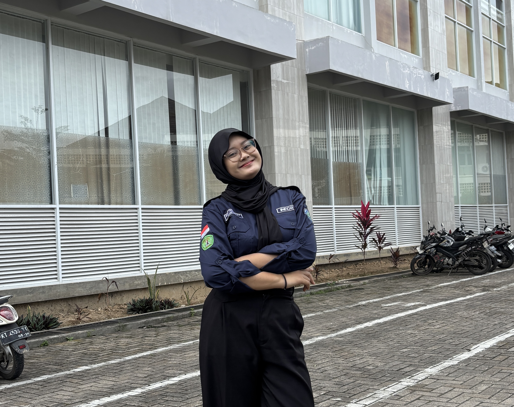

### Nama: Rizky Wahyu Dina Putri
### NIM: 2409116111

# PERSONAL PORTOFOLIO WEBSITE

## Deskripsi
Website personal portofolio yang dibangun menggunakan HTML, CSS, Bootstrap 5, dan Vue JS 3. Website ini bertujuan untuk menampilkan profil pribadi, skill, pengalaman dan sertifikat.

## Teknologi Yang Digunakan
### 1. HTML 5
Digunakan sebagai struktur dasar dari halaman web
### 2. CSS
Digunakan untuk membuat animasi, mengatur tata letak (margin, position, dll), background dari website, font size dan lain lain.
### 3. Bootstrap
Digunakan untuk membantu dalam layouting, pada website menggunakan bootstrap pada bagian navbar, grid system dan card pada sertifikat, carousel pada pengalaman.
### 4. Vue JS 
Digunakan untuk membuat tampilan lebih interaktif dan dinamis.
### 5. Google fonts
Menggunakan 2 jenis fonts yaitu Cormorant Garamond untuk judul dan nama yang aesthetic dan poppins untuk teks body.
## Code, Tampilan, dan penjelasan Setiap Section
### Navbar


```html
    <!-- Navbar -->
    <nav class="navbar navbar-expand-lg fixed-top glass-nav">
        <div class="container">
            <a class="navbar-brand fw-bold text-white" href="#">Rizky Wahyu Dina Putri </a>
            <button class="navbar-toggler" type="button" data-bs-toggle="collapse" data-bs-target="#navbarNav"
                    aria-controls="navbarNav" aria-expanded="false" aria-label="Toggle navigation">
                <span class="navbar-toggler-icon"></span>
            </button>
            <div class="collapse navbar-collapse" id="navbarNav">
                <ul class="nav nav-tabs ms-auto">
                    <li class="nav-item">
                        <a class="nav-link" :class="{ active: currentSection === 'home' }"
                        aria-current="page" href="#home">Home</a>
                    </li>
                    <li class="nav-item">
                        <a class="nav-link" :class="{ active: currentSection === 'about' }"
                        href="#about">About Me</a>
                    </li>
                    <li class="nav-item">
                        <a class="nav-link" :class="{ active: currentSection === 'certificates' }"
                        href="#certificates">Certificates</a>
                    </li>
                </ul>
            </div>
        </div>
    </nav>
```

Saat website dijalankan, pada bagian atas website terdapat navbar transparant sedikit buram yang tetap terlihat meski layar sudah di scroll. Di navbar terdapat nama "Rizky wahyu dina putri" di sebelah kiri, dan di sebelah kanan terdapat 3 tab navigasi, yaitu home, about me, dan certificates yang mewakili section di web.

Navbar dan navbar-expand-lg adalah class Bootstrap yang membuat komponen navbar responsif, ketika web dijalankan melalui dekstop maka akan terlihat seperti pada gambar, namun jika di layar kecil seperti hp atau screen split maka akan berubah menjadi garis 3 secara otomatis. 

fixed-top adalah utility Bootstrap yang membuat navbar menempel di posisi atas layar sepanjang waktu meskipun halaman di-scroll. 

pada kode class="nav nav-tabs ms-auto", nav dan nav-tabs adalah class Bootstrap untuk komponen navigasi berbentuk tab. ms-auto adalah utility spacing Bootstrap yang membuat seluruh menu ke sisi kanan secara otomatis menggunakan margin-left: auto.

#### CSS Navbar

```css
/* NAVBAR */
.glass-nav {
    background: rgba(255, 255, 255, 0.1);
    backdrop-filter: blur(14px);
    -webkit-backdrop-filter: blur(14px);
    border-bottom: 1px solid rgba(255, 255, 255, 0.2);
    padding: 14px 0;
}

.nav-tabs {
    border-bottom: none;
}

.nav-tabs .nav-link {
    color: rgba(255, 255, 255, 0.7);
    border: none;
    font-weight: 500;
    font-size: 0.9rem;
    padding: 8px 18px;
    border-radius: 30px;
    transition: all 0.3s ease;
}

.nav-tabs .nav-link:hover {
    color: #fff;
    background: rgba(255,255,255,0.15);
}

.nav-tabs .nav-link.active {
    color: #fff !important;
    background: rgba(255,255,255,0.2) !important;
    border: none !important;
    border-bottom: 2px solid #fff !important;
    border-radius: 0 !important;
}

```
### Section Home (Hero)


```html
    <!-- Section Home (Hero) -->
    <section id="home" class="vh-100 d-flex align-items-center justify-content-center position-relative overflow-hidden">
        <div class="circle circle-1"></div>
        <div class="circle circle-2"></div>
        <div class="circle circle-3"></div>

        <div class="container text-center z-2">
                <div class="hero-text-wrapper">
                    <p :class="heroClass('hero-eyebrow')">Hello, I'm</p>
                    <h1 :class="heroClass('hero-name')">
                        Rizky Wahyu<br><span class="hero-name-accent">Dina Putri</span>
                    </h1>
                    <p :class="heroClass('hero-subtitle')">Built from passion, shaped by courage, driven by purpose.</p>
                </div>
                <a href="#about" :class="heroClass('btn explore-btn mt-4')">
                    <span>Explore</span>
                    <svg width="16" height="16" viewBox="0 0 24 24" fill="none" stroke="currentColor" stroke-width="2"><path d="M12 5v14M5 12l7 7 7-7"/></svg>
                </a>
            </div>
    </section>
```
Tampilan home saat web pertama kali dijalankan, terdapat teks yang akan mucnul dengan animasi yaitu "Hello, I'm", "Rizky Wahyu Dina Putri" dan quotes singkat dibawah nama. Di tampilan ini juga terdapat circle" blur yang membuat tampilannya tidak berwarna polosan, circle" tersebut dapat bergerak secara minim dan perlahan. Circle ini dibuat menggunakan div kosong dengan class .circle, lalu dibentuk menjadi lingkaran menggunakan border-radius: 50% dan diberi efek blur besar menggunakan filter: blur(80px).

#### Vue JS Animasi Hero
```js
computed: {
    heroVisible() {
        return this.scrollY < 400;
    }
},
methods: {
    heroClass(elClass) {
        return this.heroVisible
            ? `${elClass} hero-text-in`
            : `${elClass} hero-text-out`;
    },
    handleScroll() {
        this.scrollY = window.scrollY;
    }
},
mounted() {
    window.addEventListener('scroll', this.handleScroll);
}
```
heroVisible adalah computed property yang mengembalikan true jika scrollY kurang dari 400 piksel, dan false jika sudah melewatinya. heroClass(elClass) menggunakan nilai heroVisible untuk memilih class animasi mana yang dikembalikan. handleScroll() memperbarui scrollY setiap kali event scroll terjadi, yang secara otomatis menyebabkan heroVisible dan semua elemen yang bergantung padanya ikut diperbarui oleh Vue.

#### CSS Animasi Hero

```css
/* Hero Text – base */
.hero-eyebrow {
    font-family: 'Poppins', sans-serif;
    font-size: 1rem;
    font-weight: 300;
    letter-spacing: 5px;
    text-transform: uppercase;
    color: rgba(255,255,255,0.75);
    margin-bottom: 0.5rem;
}

.hero-name {
    font-family: 'Cormorant Garamond', serif;
    font-size: clamp(3rem, 8vw, 6.5rem);
    font-weight: 600;
    color: #fff;
    line-height: 1.05;
    text-shadow: 0 4px 30px rgba(0,0,0,0.12);
    letter-spacing: -1px;
}

.hero-name-accent {
    font-style: italic;
    font-weight: 300;
    color: rgba(255,255,255,0.88);
}

.hero-subtitle {
    font-size: 1.05rem;
    letter-spacing: 4px;
    font-weight: 300;
    color: rgba(255,255,255,0.8);
    text-transform: uppercase;
    margin-top: 1rem;
}

.hero-eyebrow,
.hero-name,
.hero-subtitle,
.explore-btn {
    opacity: 0;
    transform: translateY(40px);
}

/* Animasi */
.hero-text-in {
    animation: heroFadeIn 0.8s cubic-bezier(0.22, 1, 0.36, 1) forwards;
}

.hero-text-in.hero-eyebrow  { animation-delay: 0.05s; }
.hero-text-in.hero-name     { animation-delay: 0.18s; }
.hero-text-in.hero-subtitle { animation-delay: 0.30s; }
.hero-text-in.explore-btn   { animation-delay: 0.42s; }

@keyframes heroFadeIn {
    from { opacity: 0; transform: translateY(40px); }
    to   { opacity: 1; transform: translateY(0); }
}

/* Animasi scroll kebawah*/
.hero-text-out {
    animation: heroFadeOut 0.45s cubic-bezier(0.55, 0, 1, 0.45) forwards;
}

.hero-text-out.explore-btn   { animation-delay: 0s; }
.hero-text-out.hero-subtitle { animation-delay: 0.05s; }
.hero-text-out.hero-name     { animation-delay: 0.10s; }
.hero-text-out.hero-eyebrow  { animation-delay: 0.15s; }

@keyframes heroFadeOut {
    from { opacity: 1; transform: translateY(0); }
    to   { opacity: 0; transform: translateY(-45px); }
}
```
Bagian .hero-eyebrow, .hero-name, dan .hero-subtitle mengatur tampilan teks di hero section. .hero-name adalah teks utama (nama) dengan ukuran besar dan responsif menggunakan clamp(). .hero-subtitle berfungsi sebagai quotes di bawah nama. Semua elemen hero awalnya dibuat transparan dan digeser ke bawah menggunakan opacity: 0 dan transform: translateY(40px), lalu dianimasikan dengan class .hero-text-in saat muncul dan .hero-text-out saat menghilang. Animasi heroFadeIn membuat teks naik dan fade in secara bertahap dengan delay berbeda supaya muncul satu per satu, sedangkan heroFadeOut membuat teks naik ke atas dan menghilang saat user scroll ke bawah.

### Section About Me


```html
    <!-- Section About Me -->
    <section id="about" class="py-5 section-pad">
        <div class="container">
            <h2 class="section-title text-center mb-5">About Me</h2>

            <div class="about-layout position-relative mb-5">

                <div class="about-desc-left">
                    <p class="about-desc-label">Who I Am</p>
                    <h3 class="about-desc-title">Cat Person & <br>Lifelong Learner</h3>
                    <p class="about-desc-text">
                        Halo! Aku Dinap, seorang cat person yang percaya kalau hidup itu harus seimbang antara logika dan hati.
                    </p>
                    <p class="about-desc-text">
                        Aku suka hal-hal yang kreatif, detail, dan meaningful. Selain menghabiskan waktu dengan kucing-kucing lucu, aku juga senang belajar hal baru, eksplor ide, dan mengembangkan diri
                    </p>
                </div>

                <div class="about-photo-center">
                    <div class="photo-ring">
                        <div class="photo-inner">
                            
                            <div class="photo-placeholder" style="display:none">
                                <span>📷</span>
                                <small>Foto Kamu</small>
                            </div>
                        </div>
                    </div>
                    <div class="photo-badge glass-card">
                        <span>Cat Dev</span>
                    </div>
                </div>

                <div class="about-desc-right">
                    <p class="about-desc-label">What I Do</p>
                    <h3 class="about-desc-title">Learn, Build &<br>Grow</h3>
                    <p class="about-desc-text">
                        Saat ini aku menempuh studi di bidang Sistem Informasi, di mana aku belajar menggabungkan teknologi dan bisnis untuk menciptakan solusi yang relevan dan bermanfaat.
                    </p>
                    <p class="about-desc-text">
                        Selalu belajar teknologi terbaru dan berkomitmen untuk menghasilkan karya terbaik di setiap proyek.
                    </p>
                </div>

            </div>
```
Section ini menampilkan 3 kolom yang tersusun horizontal. Kolom kiri menampilkan label "WHO I AM", judul "Cat Person & Lifelong Learner", dan dua paragraf deskripsi. Kolom tengah menampilkan foto profil berbentuk persegi panjang vertikal dengan bingkai bergradasi dan efek glow yang sedikit bergerak di samping" foto. Di bawah foto ada badge kecil "Cat Dev". Kolom kanan menampilkan label "WHAT I DO", judul "Learn, Build & Grow", dan dua paragraf deskripsi. Di layar kecil, ketiganya tersusun vertikal ke bawah.

#### CSS About Me Foto
```css
.about-desc-left,
.about-desc-right {
    flex: 1;
    max-width: 240px;
}

.about-desc-left { text-align: center; }
.about-desc-right { text-align: center; }

.about-desc-label {
    font-size: 0.7rem;
    letter-spacing: 4px;
    text-transform: uppercase;
    color: rgba(255,255,255,0.55);
    margin-bottom: 6px;
    font-weight: 500;
}

.about-desc-title {
    font-family: 'Cormorant Garamond', serif;
    font-size: 1.8rem;
    font-weight: 600;
    color: #fff;
    line-height: 1.2;
    margin-bottom: 14px;
}

.about-desc-text {
    font-size: 0.82rem;
    color: rgba(255,255,255,0.72);
    line-height: 1.75;
    margin-bottom: 10px;
}

```
```css
/* Foto about me*/
.about-photo-center {
    position: relative;
    flex-shrink: 0;
}

.photo-ring {
    width: 300px;
    height: 460px;
    border-radius: 28px;
    padding: 5px;
    background: linear-gradient(135deg, rgba(255,255,255,0.6), rgba(255,255,255,0.15));
    box-shadow: 0 0 60px rgba(161, 140, 209, 0.4);
    animation: ringPulse 3s ease-in-out infinite;
}

@keyframes ringPulse {
    0%, 100% { box-shadow: 0 0 40px rgba(161, 140, 209, 0.3); }
    50%       { box-shadow: 0 0 80px rgba(255, 154, 158, 0.5); }
}

.photo-inner {
    width: 100%;
    height: 100%;
    border-radius: 24px;
    overflow: hidden;
    background: rgba(255,255,255,0.1);
    display: flex;
    align-items: center;
    justify-content: center;
}

.profile-photo {
    width: 100%;
    height: 100%;
    object-fit: cover;
    object-position: top;
}

.photo-placeholder {
    flex-direction: column;
    align-items: center;
    justify-content: center;
    color: rgba(255,255,255,0.6);
    gap: 6px;
    font-size: 2.5rem;
    text-align: center;
}

.photo-badge {
    position: absolute;
    bottom: -16px;
    left: 50%;
    transform: translateX(-50%);
    padding: 6px 20px;
    border-radius: 30px;
    font-size: 0.8rem;
    font-weight: 600;
    color: #fff;
    white-space: nowrap;
    backdrop-filter: blur(10px);
}

```
photo ring berukuran 300×460px dengan border-radius: 28px agar berbentuk persegi panjang dengan border lengkung. Animasi ringPulse membuat box shadow menjadi cahaya di sekeliling foto. object-fit: cover dan object-position: top pada profile-photo memastikan foto fit pada photo ringnya.

### Skill Cards


```html
            <div class="skills-row-wrapper mb-5">
                <div class="skills-row-group">
                    <div v-for="skill in skillGroups[0].items" :key="skill.name"
                        class="skill-chip glass-card">
                        <div class="skill-chip-header">
                            <span class="skill-name">{{ skill.name }}</span>
                        </div>
                        <div class="skill-bar-wrap">
                            <div class="skill-bar-fill" :style="{ width: showElements ? skill.level : '0%' }"></div>
                        </div>
                        <span class="skill-percent">{{ skill.level }}</span>
                    </div>
                </div>

                <div class="skills-row-group">
                    <div v-for="skill in skillGroups[1].items" :key="skill.name"
                        class="skill-chip glass-card">
                        <div class="skill-chip-header">
                            <span class="skill-name">{{ skill.name }}</span>
                        </div>
                        <div class="skill-bar-wrap">
                            <div class="skill-bar-fill" :style="{ width: showElements ? skill.level : '0%' }"></div>
                        </div>
                        <span class="skill-percent">{{ skill.level }}</span>
                    </div>
                </div>
            </div>
```
Setiap card berisi nama skill dan progress bar putih. Saat pertama kali user scroll ke section ini, progress bar mengisi secara animasi dari 0% ke nilai yang ditentukan.

#### CSS Skill Card
```css
/* Skill */
.skills-row-wrapper {
    display: flex;
    gap: 20px;
    justify-content: center;
    flex-wrap: wrap;
}

.skills-row-group {
    display: flex;
    gap: 16px;
    flex-wrap: wrap;
    justify-content: center;
}

.skill-chip {
    width: 185px;
    padding: 12px 16px;
    border-radius: 16px !important;
    animation: chipFloat 0.6s cubic-bezier(0.22, 1, 0.36, 1) both;
}

.skill-chip:nth-child(1) { animation-delay: 0.1s; }
.skill-chip:nth-child(2) { animation-delay: 0.2s; }
.skill-chip:nth-child(3) { animation-delay: 0.3s; }

@keyframes chipFloat {
    from { opacity: 0; transform: scale(0.85) translateY(20px); }
    to   { opacity: 1; transform: scale(1) translateY(0); }
}

.skill-chip-header {
    display: flex;
    align-items: center;
    gap: 8px;
    margin-bottom: 8px;
}

.skill-name {
    color: #fff;
    font-size: 0.8rem;
    font-weight: 500;
    white-space: nowrap;
}

.skill-bar-wrap {
    height: 6px;
    background: rgba(255,255,255,0.2);
    border-radius: 10px;
    overflow: hidden;
}

.skill-bar-fill {
    height: 100%;
    background: linear-gradient(90deg, rgba(255,255,255,0.9), rgba(255,255,255,0.5));
    border-radius: 10px;
    transition: width 1.2s cubic-bezier(0.22, 1, 0.36, 1);
}

.skill-percent {
    display: block;
    text-align: right;
    color: rgba(255,255,255,0.6);
    font-size: 0.7rem;
    margin-top: 4px;
}

```
### Experience Carousel


```html
            <h4 class="text-white text-center mb-4 fw-semibold">Experience</h4>
            <div id="carouselExperience" class="carousel slide experience-carousel" data-bs-ride="carousel">
                <div class="carousel-indicators">
                    <button v-for="(exp, index) in experiences" :key="index"
                            type="button"
                            data-bs-target="#carouselExperience"
                            :data-bs-slide-to="index"
                            :class="{ active: index === 0 }"
                            :aria-current="index === 0 ? 'true' : undefined"
                            :aria-label="'Slide ' + (index + 1)">
                    </button>
                </div>
                <div class="carousel-inner">
                    <div v-for="(exp, index) in experiences" :key="exp.role"
                        class="carousel-item"
                        :class="{ active: index === 0 }">
                        <div class="exp-slide position-relative overflow-hidden">
                            <!-- Background Photo -->
                            
                            <!-- Blur Overlay -->
                            <div class="exp-overlay"></div>
                            <!-- Content -->
                            <div class="exp-content text-center position-relative">
                                <div class="exp-year-badge mb-3">{{ exp.year }}</div>
                                <h4 class="text-white fw-bold">{{ exp.role }}</h4>
                                <p class="text-white-50 mb-3">{{ exp.company }}</p>
                                <p class="text-white" style="opacity:0.9; line-height:1.8;">{{ exp.desc }}</p>
                            </div>
                        </div>
                    </div>
                </div>
                <button class="carousel-control-prev" type="button" data-bs-target="#carouselExperience" data-bs-slide="prev">
                    <span class="carousel-control-prev-icon" aria-hidden="true"></span>
                    <span class="visually-hidden">Previous</span>
                </button>
                <button class="carousel-control-next" type="button" data-bs-target="#carouselExperience" data-bs-slide="next">
                    <span class="carousel-control-next-icon" aria-hidden="true"></span>
                    <span class="visually-hidden">Next</span>
                </button>
            </div>

        </div>
    </section>
```
Di bawah skill cards terdapat judul "Experience" dan carousel Bootstrap tiga slide. Setiap slide menampilkan foto kegiatan sebagai background yang di-blur dan digelapkan, teks detail pengalaman (tahun, jabatan, organisasi, deskripsi) di tengahnya. Di bawah carousel terdapat tiga titik indikator, dan di kiri-kanan terdapat tombol panah lingkaran untuk navigasi manual. Carousel juga dapat berjalan otomatis berpindah slide.

#### CSS Carousel
```css
.experience-carousel {
    max-width: 800px;
    margin: 0 auto;
    padding-bottom: 50px;
}

.exp-slide {
    border-radius: 24px;
    overflow: hidden;
    height: 380px;
    position: relative;
}

/* background photo */
.exp-bg-photo {
    position: absolute;
    inset: 0;
    width: 100%;
    height: 100%;
    object-fit: cover;
    object-position: center;
    filter: blur(6px) brightness(0.6);
    transform: scale(1.08); /* prevent blur edge bleed */
    z-index: 0;
}

/* overlay blur */
.exp-overlay {
    position: absolute;
    inset: 0;
    background: linear-gradient(
        to top,
        rgba(30, 10, 60, 0.75) 0%,
        rgba(30, 10, 60, 0.35) 60%,
        rgba(0, 0, 0, 0.1) 100%
    );
    z-index: 1;
}

/* Text content experience*/
.exp-content {
    position: relative;
    z-index: 2;
    padding: 50px 60px;
    height: 100%;
    display: flex;
    flex-direction: column;
    align-items: center;
    justify-content: center;
}

.exp-year-badge {
    display: inline-block;
    background: rgba(255,255,255,0.18);
    border: 1px solid rgba(255,255,255,0.45);
    color: #fff;
    border-radius: 30px;
    padding: 4px 18px;
    font-size: 0.78rem;
    letter-spacing: 1px;
    font-weight: 500;
    backdrop-filter: blur(6px);
}

.carousel-indicators {
    bottom: -40px;
}

.carousel-indicators button {
    width: 10px !important;
    height: 10px !important;
    border-radius: 50% !important;
    background-color: rgba(255,255,255,0.5) !important;
    border: none !important;
    margin: 0 4px !important;
    transition: background 0.3s ease;
}

.carousel-indicators button.active {
    background-color: #fff !important;
}

.carousel-control-prev,
.carousel-control-next {
    width: 44px;
    height: 44px;
    top: 50%;
    transform: translateY(-50%);
    background: rgba(255,255,255,0.2);
    border: 1px solid rgba(255,255,255,0.3);
    border-radius: 50%;
    backdrop-filter: blur(6px);
}

.carousel-control-prev { left: -60px; }
.carousel-control-next { right: -60px; }
```

### Section Certificates


```html
    <section id="certificates" class="py-5 section-pad">
        <div class="container">
            <h2 class="section-title text-center mb-5">Certificates</h2>
            <div class="row g-4 justify-content-center">
                <div v-for="cert in certificates" :key="cert.id"
                    class="col-md-6 col-lg-4 cert-card-wrapper"
                    :class="{ 'animate-fade-up': showElements }">
                    <div class="card h-100 glass-card cert-card border-0">
                        
                        <div class="card-body text-center">
                            <h5 class="card-title text-white fw-bold">{{ cert.title }}</h5>
                            <p class="card-text text-white-50 small">{{ cert.issuer }}</p>
                            <button @click="openCertModal(cert.image)" class="btn btn-light btn-sm rounded-pill mt-2">
                                Lihat Detail
                            </button>
                        </div>
                    </div>
                </div>
            </div>
        </div>
    </section>

    <!-- Modal Sertifikat -->
    <div v-if="isModalOpen" class="modal-backdrop fade show"></div>
    <div v-if="isModalOpen" class="modal fade show d-block" tabindex="-1" @click.self="closeCertModal">
        <div class="modal-dialog modal-dialog-centered modal-lg">
            <div class="modal-content bg-transparent border-0">
                <div class="modal-body p-0 position-relative">
                    <button type="button" class="btn-close btn-close-white position-absolute top-0 end-0 m-3 z-3" @click="closeCertModal"></button>
                    
                </div>
            </div>
        </div>
    </div>

```
Section Certificates ini dibuat untuk menampilkan semua sertifikat dalam bentuk card, dan datanya di-generate otomatis pakai v-for dari array certificates. Di dalam card ada gambar, judul, issuer, dan tombol “Lihat Detail” yang akan menjalankan function openCertModal(cert.image) saat diklik.
:src="modalImage" adalah Vue binding yang menampilkan gambar sertifikat yang dipilih. class="img-fluid rounded shadow-lg" — img-fluid dari Bootstrap membuat gambar responsif (tidak melebihi lebar containernya), rounded membulatkan sudut, dan shadow-lg memberikan bayangan besar di sekeliling gambar.

#### Vue HS Modal
```js
        openCertModal(imageUrl) {
            this.modalImage = imageUrl;
            this.isModalOpen = true;
            document.body.style.overflow = 'hidden';
        },
        closeCertModal() {
            this.isModalOpen = false;
            this.modalImage = '';
            document.body.style.overflow = 'auto';
        }
```
document.body.style.overflow = 'hidden' mencegah halaman di-scroll ketika modal terbuka. document.body.style.overflow = 'auto' mengembalikannya ke normal saat modal ditutup.

# DOKUMENTASI


